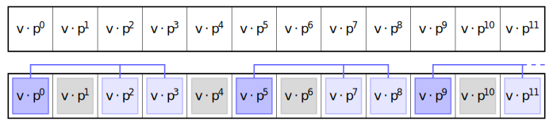
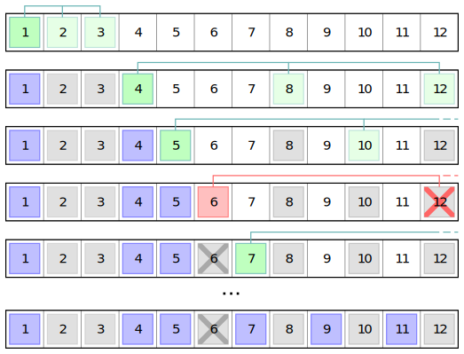

> **Abstract.** Returning to density, we examine our main conjecture fI'll prove that if $A, 2A, 3A$ are disjoint, then $\newcommand{\NN}{\mathbb N}
\newcommand{\PP}{\mathbb P}
\newcommand{\dnat}{\mathrm d}
\newcommand{\dsup}{\overline{\mathrm d}}
\newcommand{\dinf}{\underline{\mathrm d}}
\newcommand{\proofqed}{\quad\quad\quad\square}\dsup(A) \leq 6/11$.  
This proof will extend to a bound for $\lbrace 1, p, q\rbrace$ for any $1 < p < q \leq p^2$.

---

This is the third post in a series on density.  
Read [Density and GCDs][density1] and [Nearly Disjoint Dilations: Primes][density2] first.

Here is the conjecture we continue to contemplate:

> **Conjecture 1.** Suppose $A \perp B$. Then $\dsup(A) \leq H(B)^{-1}$.  
> When $H(B) = \infty$, the conclusion is $\dsup(A) = 0$.

At this point I'll assume you're familiar with my choice of notation.  
If you're not, then read the previous two posts.

Let's start by tallying up our current score against it:

> Using [Lemma 9][density1] we have a proof if $B$ is the finite set of all divisors of some integer.  
> In general, if $B$ is finite and we have a set $U$ such that $U \times B = \NN$ and $\dsup(U) \leq H(B)^{-1}$, then the lemma proves this case. This is the "trivial" finite case.
> 
> By a limiting argument, we can use the trivial finite cases to prove some divergent infinite cases like $B = \NN$ or $B = \lbrace 2k+1 \mid k \geq 0 \rbrace$ for example, as in [the gcd problem][density1].
> 
> With complicated probabilistic arguments, one can use a variant of Lemma 9 to prove the divergent coprime case, when $H(B)$ diverges and the elements of $B$ are relatively prime. This is the topic of the [second density post][density2], see the proof of Theorem 1. This includes $B = \PP$.

This is roughly where we left off.  
Our goal for today is to examine the general finite case and prove as much as we can.  
This is going to be an interesting and maybe complicated journey.

## Finite $B$ For Infants

Let's talk about the "trivial" case.  
Given a finite $B$, when can we find $U \times B = \N$ with $\dsup(U) \leq H(B)^{-1}$?  
This seems hard. We know we can do it when $B$ is the set of all divisors of an integer.  
Can we do any others this way? Sure!

The easiest one I can think of is $B = \lbrace 1, 4 \rbrace$, for which we can pick
$$U = \lbrace 1, 2 \rbrace \times \lbrace 16^i \mid i \geq 0 \rbrace \times \lbrace 2i+1 \mid i \geq 0 \rbrace$$
The last set has density $\frac{1}{2}$, then [Lemma 7][density1] twice gives
$$\dnat(U) = \left(1+\frac{1}{2}\right) \cdot \left(\sum_{i \geq 0} \frac{1}{16^i}\right) \cdot \frac{1}{2} = \frac{4}{5} = \left(1 + \frac{1}{4}\right)^{-1}$$
If you are uneasy about this, try verifying the details of Lemma 7 yourself, specifically make sure you understand why $\lbrace 2i+1 \mid i \geq 0\rbrace \perp \lbrace 16^i \mid i \geq 0\rbrace$ for example. Basically this is just a matter of being familiar with what my $\perp$ notation means.

Anyways, the most important reason why this one worked is that we can factorize $\N = U \times B$ where each $n$ has a unique representation as $u \cdot b$ where $u \in U, b \in B$. The literature calls these "direct factors" of $\N$, and it is proved in the paper [here][saffari] by Erdős, Saffari, and Vaughan that $\dnat(U)$ exists and equals $H(B)^{-1}$.

So if $B$ is a finite member of a direct factor pair, then our conjecture holds.

What if $B$ is less nice?

## "One-Dimensional" Case

Let's pick an integer $p > 1$ not necessarily prime, and consider $B \subseteq \lbrace 1, p, p^2, \ldots \rbrace$.

First, if $B$ is something like $\lbrace 1, p, p^2, p^3, p^4 \rbrace$, or some other complete prefix, then we can write $B$ as a member of a direct factor pair relatively simply as follows:

Let $U_0$ be the set of all proper divisors of $p$, and let $U_1$ be the set $\lbrace p^{5i} \mid i \geq 0\rbrace$.  
Also let $U_2$ be the set of all integers relatively prime to $p$.  
We can set $U = U_0 \times U_1 \times U_2$ and then $U \times B$ is a direct factor pair!

We don't even need Saffari's result here. Factor $p = q_1^{e_1} q_2^{e_2} \ldots q_k^{e_k}$ where $q_i$ are different primes.  
Now consider a general $n = q_1^{r_1} q_2^{r_2} \ldots q_k^{r_k} m$ where $m$ is relatively prime to $p$, and observe that we can consider the $r_i$ mod $5e_i$ and then mod $e_i$ to uniquely write $n$ as a product in $U_0 \times U_1 \times U_2 \times B$. The details are not exactly immediate, but writing them out here is not as enlightening as having you do it yourself, especially if it's not intuitively obvious why it works.

Okay, but what about something like $B = \lbrace 1, p^2, p^3 \rbrace$, where it's not part of a direct factor pair?

For this and other similar cases, we introduce a natural way of displaying these sets graphically.  

Assuming $B \subseteq \lbrace 1, p, p^2, \ldots \rbrace$, we start by decomposing $\N = V_{\text{div}} \times V_\text{pow} \times V_\text{rel}$, where
- $V_{\text{div}}$ is the set of proper divisors of $p$
- $V_\text{pow}$ is the set of powers of $p$
- $V_\text{rel}$ is the set of integers relatively prime to $p$

This is the big idea:

> **Lemma TODO.** Assume $A \perp B$ where $B$ is a finite subset of $\lbrace 1, p, p^2, \ldots \rbrace$.  
> In this case, since $B$ is finite, assume that each $b_1 A \cap b_2 A$ is empty (see [Lemma 15][density2]).  
> For each $v \in V_\text{div} \times V_\text{rel}$, we examine the set $W = A \cap v V_\text{pow}$.  
> Then the condition on $A$ is equivalent to that $b_1 W \cap b_2 W$ is empty for $b_1 \neq b_2 \in B$.  
> This way we reduce the study to subsets of geometric series in $p$.

The behavior of $A \cap v V_\text{pow}$ is essentially independent of $v$, but when we look at prefixes of $A$ then the relative size of $v$ will play a part in determining how the chunk is filled.

Since we are now examining parts of $A$ which are subsets of certain geometric series, we will visualize this as a sequence of squares as in the following diagram.

$$A \perp \lbrace 1, p^2, p^3 \rbrace$$

$$W = A \cap v V_\text{pow} = \lbrace v, v \cdot p^5, v \cdot p^9 \rbrace$$

$$W \cap p^2 W = W \cap p^3 W = p^2 W \cap p^3 W = \emptyset$$

We see we're slotting together disconnected blobs with no overlap.  
You should notice that in the shown configuration there is unnecessary empty space at $v \cdot p^4$, we are able to slide everything afterwards towards the left one square and achieve a "better" packing.

You should also notice that the empty square inside the blob will never be filled! In fact,

> **Lemma.** If $A \perp \lbrace 1, p^2, p^3 \rbrace$, then $A \perp \lbrace 1, p, p^2, p^3 \rbrace$ so 
> 
$$\dsup(A) \leq H(\lbrace 1, p, p^2, p^3 \rbrace)^{-1} < H(\lbrace 1, p^2, p^3 \rbrace)^{-1}$$

_Proof._ We have $A \cap pA = \frac{1}{p^2} \left(p^2A \cap p^3A\right)$ has density zero.  
The set $\lbrace 1, p, p^2, p^3 \rbrace$ is trivial so we are done. $\proofqed$

So maybe this is not quite the most interesting case ever but we'll pretend otherwise because I can only draw so many squares without going insane.

Instead of that observation, it is slightly more interesting to consider the whole idea of reducing wasted space by sliding the shapes downwards. First we have to actually relate this to density.

TODO

## $B = \lbrace 1, 2, 3\rbrace$

Here we have $H(B) = 11/6$, and so we need to prove $\dsup(A) \leq 6/11$.

The first thing to notice is that thanks to [Lemma 15][density2], we can reduce the study of the case $A \perp \lbrace 1, 2, 3\rbrace$ to the case $A, 2A, 3A$ disjoint. From here on we'll assume this stronger condition.

---

## Lower Density

The first idea to explore is to see what happens when we greedily shove elements into $A$, lowest first.

After some time we arrive at $A = \lbrace 1, 4, 5, 7, 9, 11, 13, 16, \ldots \rbrace$.

> **Lemma TODO.** The set $A$ consists of all $4^i 9^j k$ where $\gcd(k, 6) = 1$.

_Proof._ Search the sequence on OEIS.  
Suppose we have proven that $A \cap \lbrack 1 .. n \rbrack$ is full of the desired elements, and let $n+1$ be written in the form $2^i 3^j k$ for $i, j \geq 0$ and $\gcd(k, 6) = 1$. Suppose that $i, j$ are not both even, we will show that $n+1$ cannot be included in the set $A$.

If $i$ is odd and $j$ is even, then $2^{i-1}3^jk$ is an element of $A$, and so $n+1$ is twice an element of $A$ and cannot be added to the set. A similar idea works if $i$ is even and $j$ is odd.

If $i, j$ are both odd, then $2^{i+1} 3^{j-1}k = \frac{2}{3}(n+1) \leq n$ is an element of $A$.  
Then $2A$ would contain $2(n+1) = 2^{i+1} 3^j k$ and $3A$ would contain $3 \cdot 2^{i+1}3^{j-1}k = 2^{i+1} 3^j k$.  
In this case, $2A$ and $3A$ are not disjoint.

So $n+1 = 2^i 3^j k$ can only be included in $A$ if $i, j$ are both even. $\proofqed$

Let's also compute the density of this set for good measure.

We'll decompose $A = A_0 \times A_1$ where $A_0 = \lbrace 4^i 9^j \mid i, j \geq 0 \rbrace$ and $A_1 = \lbrace k \mid \gcd(k, 6) = 1 \rbrace$.  
We can verify that $A_1$ is periodic and so has density $\frac{2}{6} = \frac{1}{3}$.  
Also, $A_1 \perp A_0$, so by [Lemma 7][density1],

$$\dnat(A) = \dnat(A_1) H(A_0) = \frac{1}{3} \sum_{i, j \geq 0} \frac{1}{4^i 9^j} = \frac{1}{2}$$

---

Perhaps surprisingly, we can prove a very good upper bound on the lower density of $A$.  
This section is dedicated to providing a proof that, if $S \perp \lbrace 1, 2, 3 \rbrace$, then $\dinf(S) \leq \frac{1}{2}$.

To do so, we need to introduce the concept of logarithmic density.

$$\newcommand{\ldnat}{\mathrm \delta}
\newcommand{\ldsup}{\overline{\mathrm \delta}}
\newcommand{\ldinf}{\underline{\mathrm \delta}}\begin{align*}
\ldsup(A) &= \limsup_{x \to \infty} \frac{1}{\log(x)}\sum_{n \leq x,\, n \in A} \frac{1}{n}\\
\ldinf(A) &= \liminf_{x \to \infty} \frac{1}{\log(x)}\sum_{n \leq x,\, n \in A} \frac{1}{n}
\end{align*}$$

and obviously we define $\ldnat(A) = \ldsup(A) = \ldinf(A)$ if the limit exists.

The reason for $\log(x)$ as the denominator is that it is asymptotic to $\sum_{n \leq x} \frac{1}{n}$.  
Therefore logarithmic density is really just a weighted version of regular density.

Another way to think about this is in terms of random variables, which I like a lot.  
In the case of natural density, we're looking at uniform random variables $X$ on $\lbrace 1, 2, 3, \ldots, \lfloor x \rfloor \rbrace$, and then $\dsup(A) = \limsup_{x \to \infty} \text{Pr}(X \in A)$ for example.  
For logarithmic density, instead of a uniform distribution, we have $\text{Pr}(X = n) \propto \frac{1}{n}$ for each $n \leq x$, so the variable is skewed more towards being smaller. This dampens the effects of oscillations in the set $A$, so (for example) the set $A$ of integers with an odd number of binary bits _does_ have a logarithmic density, equal to $1/2$ (see the first section of [Density and GCDs][density1]).

One key property of logarithmic density we're going to use is the following:

> **Lemma TODO.** We have $\dinf(A) \leq \ldinf(A)$. Consequently, also $\dsup(A) \geq \ldsup(A)$.

_Proof._ Suppose we pick any $c > 0$ so that $\dinf(A) > c$.  
Then for all large $x$, say $x \geq x_0$, we have $A(x) \geq cx$.

Now use [Abel's summation theorem][abel] to write

$$\begin{align*}
\sum_{n \leq x,\, n \in A} \frac{1}{n} &= \frac{A(x)}{x} + \int_1^x \frac{A(t)}{t^2}dt\\
&\geq \int_{x_0}^x \frac{ct}{t^2}dt\\
&= c\int_{x_0}^x \frac{1}{t}dt\\
&= c \log(x) - c \log(x_0)
\end{align*}$$

and therefore we have $\ldinf(A) \geq c$. Letting $c \to \dinf(A)$ from below we have $\ldinf(A) \geq \dinf(A)$.

The bound $\dsup(A) \geq \ldsup(A)$ comes from considering $A' = \NN - A$.  
We have $\dsup(A) = 1-\dinf(A') \geq 1-\ldinf(A') = \ldsup(A)$. $\proofqed$.

We will prove that if $A \perp \lbrace 1, 2, 3 \rbrace$, then $\ldinf(A) \leq \frac{1}{2}$, hence $\dinf(A) \leq \frac{1}{2}$.

From here on, let's write $Q$ for the set of all naturals of the form $6k \pm 1$ (equivalently the set of all naturals not divisible by $2$ or by $3$), and also write $R$ for the set of all integers of the form $2^i 3^j$. This way, all of the dilations $rQ$ are disjoint (so that $Q \perp R$), and $Q \times R = \NN$.

Immediately (by [Lemma 7][density1]) we have

$$\dnat(Q) = \left(\sum_{i, j \geq 0} \frac{1}{2^i 3^j}\right)^{-1} = \frac{1}{3}$$

This setup is particularly useful to us in this problem.

Let's say we have figured out some set $B$ such that $B, 2B, 3B$ are disjoint, but rather than allowing $B \subseteq \NN$, we restrict all of its elements to be of the form $2^i 3^j$ (so that $B \subseteq R$). Clearly such a set has density zero, since $R(x) = O(\log(x)^2)$.

We can then construct from this a set $A \subseteq \NN$, with nonzero density, such that $A, 2A, 3A$ are disjoint. The idea is to fill in all the missing prime factors - simply use $A = Q \times B$.

Since $Q \perp R$ and $B \subseteq R$, we have $Q \perp B$, and (Lemma 7) we have $\dnat(A) = \dnat(Q) H(B) = \frac{1}{3}H(B)$.

When it comes to sets of this form, then, we should attempt to put an upper bound on $H(B)$.

To be clear: if $B$ is a set of integers, all of the form $2^i 3^j$, such that $B, 2B, 3B$ are disjoint, then how large can $H(B) = \sum_{b \in B} \frac{1}{b}$ be?

A first attempt looks like this:

$$\begin{align*}
3 = \sum_{i, j \geq 0} \frac{1}{2^i 3^j} &\geq \sum_{n \in B \cup 2B \cup 3B} \frac{1}{n}\\
&\geq \sum_{b \in B} \left(\frac{1}{b} + \frac{1}{2b} + \frac{1}{3b}\right)\\
&\geq \left(1 + \frac{1}{2} + \frac{1}{3}\right)\sum_{b \in B} \frac{1}{b}\\
&\geq \frac{11}{6} H(B)
\end{align*}$$

so therefore we get the easy bound $H(B) \leq \frac{18}{11} \approx 1.64$.

If we translate this back, for sets of the form we discussed before, we get $\dnat(A) \leq \frac{1}{3} \times \frac{18}{11} = \frac{6}{11}$. Note that this does *not* prove $\dsup(A) \leq \frac{6}{11}$ for all sets $A$ such that $A, 2A, 3A$ are disjoint, but only for those of the special type $Q \times B$ as before.

We can get a better bound on $H(B)$ (in fact, the best possible bound) as follows:

> **Lemma TODO.** Let $B$ be any set of integers, all of the form $2^i 3^j$, such that $B, 2B, 3B$ are disjoint.  
> Then $H(B) = \sum_{b \in B} \frac{1}{b} \leq \frac{3}{2} = 1.5$.

_Proof._ This proof bears some resemblance to the ideas present in the previous section - split all the integers $2^i 3^j$ into nice sections in which we better understand how the elements of $B$ can fit together.

For every integer $k \geq 0$, write $Q_k = \sum \frac{1}{b}$ over those elements $b = 2^i 3^j \in B$ satisfying $i+j = k$. Thinking geometrically, if we plot each $2^i 3^j$ at the point $(i, j)$ in a quarter plane, each $Q_k$ is a diagonal strip of length $k+1$.

***TODO DIAGRAM***

We'll be thinking in terms of pairs of diagonals $Q_{2k}$ and $Q_{2k+1}$.  
Notice that $2Q_{2k} \subseteq Q_{2k+1}$ and $3Q_{2k} \subseteq Q_{2k+1}$.  
The strategy here is to obtain an upper bound on $H(B \cap Q_{2k}) + H(B \cap Q_{2k+1})$, and then add this over all $k \geq 0$ to obtain an upper bound on $H(B)$.

Because $B, 2B,$ and $3B$ are all disjoint, we have

$$\begin{align*}
H(Q_{2k+1}) &\geq H\left((B \cup 2B \cup 3B) \cap Q_{2k+1}\right)\\
&\geq H(B \cap Q_{2k+1}) + H(2B \cap Q_{2k+1}) + H(3B \cap Q_{2k+1})\\
&\geq H(B \cap Q_{2k+1}) + \frac{1}{2} H(B \cap Q_{2k}) + \frac{1}{3} H(B \cap Q_{2k})\\
&\geq H(B \cap Q_{2k+1}) + \left(\frac{1}{2} + \frac{1}{3}\right) H(B \cap Q_{2k})
\end{align*}$$

We can add $\left(1 - \frac{1}{2} - \frac{1}{3}\right)H(B \cap Q_{2k})$ to both sides to obtain

$$H(Q_{2k+1}) + \left(1 - \frac{1}{2} - \frac{1}{3}\right)H(B \cap Q_{2k}) \geq H(B \cap Q_{2k+1}) + H(B \cap Q_{2k})$$

So we see that to get the best upper bound on the right hand side, we should attempt to maximize $H(B \cap Q_{2k})$.

It happens that since $Q_{2k}$ is a single diagonal (see the diagrams), to maximize $H(B \cap Q_{2k})$ we need to prioritize the inclusion of smaller numbers. You can visualize this as "sliding" all the elements down:

***TODO DIAGRAM***

Thus we see that $H(B \cap Q_{2k})$ is maximized when the relevant elements of $B$ are all $2^i 3^j$ where $i+j = 2k$ and both $i, j$ are even:

***TODO DIAGRAM***

In this case, we can see that $\left(\frac{1}{2} \frac{1}{3}\right)H(B \cap Q_{2k})$ is exactly equal to $H(Q_{2k+1})$, since for each $2^i 3^j$ with $i+j = 2k+1$, exactly one of $i$ or $j$ must be odd, corresponding to $\frac{1}{2}H(B \cap Q_{2k})$ or $\frac{1}{3} H(B \cap Q_{2k})$ respectively:

***TODO DIAGRAM***

TODO FINISH $\proofqed$

So then, returning to our sets $A = Q \times B$, we have $\dnat(A) \leq \frac{1}{3} \times \frac{3}{2} = \frac{1}{2}$.  
This looks really good, but we remember that this currently has no 

---

## Upper Density

We will not skip straight to my proof. Instead I'll first invite you to try to prove it yourself.

I think that most attempts at a proof for this case will slightly fall short of the desired bound. It's strange how elusive it seems to be, which is even stranger when you see my proof, which provides an even stronger bound than needed. That's actually another interesting aspect here, but not so surprising if you think about it[^2].

The first thing we could notice is that if $A \perp \lbrace 1, 2, 3 \rbrace$, then naturally $A \perp \lbrace 1, 2\rbrace$. This case is quite easy! We can for example let $U$ be the set of all $4^i * j$ for $i \geq 0$ and $j$ odd, after which $U \times \lbrace 1, 2 \rbrace = \NN$ and [Lemma 9][density1] kicks in - we get $\dsup(A) \leq \frac{2}{3}$. The details here are not hard to fill in, [Lemma 7][density1] being especially helpful.

Unfortunately though this is quite far from our desired bound. 

A next attempt can be made by using the counting function $A(x) = \left\vert A \cap \lbrace 1, 2, \ldots, \lfloor x \rfloor\rbrace\right\vert$.

Write $R = A\cup 2A \cup 3A$, so that $R(x) = A(x) + A(x/2) + A(x/3)$.

We'll start with the bound $R(x) - R(x/2) \leq \frac{x}{2} + 1$. Expanding the function,

$$\begin{align*}
R(x) - R(x/2) &\leq \frac{x}{2} + 1\\
A(x) + A\left(\frac{x}{2}\right) + A\left(\frac{x}{3}\right) - A\left(\frac{x}{2}\right) - A\left(\frac{x}{4}\right) - A\left(\frac{x}{6}\right) &\leq \frac{x}{2} + 1
\end{align*}$$

Since $\frac x3 > \frac x4$, the term $A(x/3) - A(x/4)$ is nonnegative and can be removed from the left hand side:

$$A(x) - A\left(\frac{x}{6}\right) \leq \frac{x}{2} + 1$$

Now substituting $x/6$:

$$A\left(\frac{x}{6}\right) - A\left(\frac{x}{6^2}\right) \leq \frac{x}{2 \cdot 6} + 1$$

And then substituting $x/6$ again, and so on, until $x/6^n < 1$, we obtain

$$\begin{align*}
A(x) &= \left\lbrack A(x) - A\left(\frac x6\right)\right\rbrack + \left\lbrack A\left(\frac x6\right) - A\left(\frac{x}{6^2}\right)\right\rbrack + \ldots + \left\lbrack A\left(\frac{x}{6^{n-1}}\right) - A\left(\frac{x}{6^n}\right)\right\rbrack\\
&\leq \left\lbrack \frac{x}{2} + 1\right\rbrack + \left\lbrack \frac{x}{2 \cdot 6} + 1\right\rbrack + \left\lbrack \frac{x}{2 \cdot 6^2} + 1\right\rbrack + \ldots + \left\lbrack \frac{x}{2 \cdot 6^{n-1}} + 1\right\rbrack\\
&\leq n + \left(\sum_{k \geq 0} \frac{1}{2 \cdot 6^k}\right)x\\
&\leq n + \frac{3}{5}x
\end{align*}$$

We only needed to simplify a geometric series to get this result. We have $n = O(\log(x))$, so

$$A(x) \leq \frac{3}{5}x + O(\log(x))$$

Thus immediately $\dsup(A) \leq \frac{3}{5} = 0.6$, which is better than $2/3$ but worse than $6/11 = 0.54\ldots$ which still is out of reach. Maybe there's some way to modify this telescoping method to get a tighter bound. Clearly there was some loss when we threw out $A(x/3) - A(x/4)$.

---

The best way that I have found to prove the desired result relies on the following idea.

> **Lemma 18.** If $S \cup T = \NN$ then $\dsup(A) \leq \dsup(A \cap S) + \dsup(A \cap T)$.

_Proof._ This is a consequence of subadditivity of lim sup (see [Lemma 2](density1)). $\proofqed$

> **Lemma 19.** If $S_1 \cup S_2 \cup \ldots = \NN$, and $\lim_{n \to \infty} \dsup(S_{n+1} \cup S_{n+2} \cup \ldots) = 0$, then
>
$$\dsup(A) \leq \sum_{k \geq 1} \dsup(A \cap S_k)$$

_Proof._ This is intuitive but actually seems subtle so I am going to give it real thought.  
Lemma 18 can be extended to families $S_1, S_2, \ldots, S_n$ without thinking by just applying it $n-1$ times.  
Now notice that

$$\NN - (S_1 \cup S_2 \cup \ldots \cup S_n) \subseteq S_{n+1} \cup S_{n+2} \cup \ldots$$

so that by Lemma 18, we have

$$\dsup(A) \leq \sum_{k \leq n} \dsup(A \cap S_k) + \dsup(S_{k+1} \cup S_{k+2} \cup \ldots)$$

If any partial sum for a given $n$ exceeds $1$ then we are trivially done. Otherwise it is bounded, and by monotonicity the sum converges to some constant $c = \sum_{k \geq 1} \dsup(A \cap S_k)$. We then have

$$\dsup(A) \leq c + \dsup(S_{k+1} \cup S_{k+2} \cup \ldots) \to c$$

and therefore that $\dsup(A) \leq \sum_{k \geq 1} \dsup(A \cap S_k)$ as desired. $\proofqed$

We will rewrite the inequality as follows when all $\dnat(S_k)$ exist:

$$\dsup(A) \leq \sum_{k \geq 1} \frac{\dsup(A \cap S_k)}{\dnat(S_k)} \cdot \dnat(S_k)$$

The conceptual reason for this may be clear.

The quantity $\frac{\dsup(A \cap S_k)}{\dnat(S_k)}$ can be interpreted as the relative density of $A$ in $S_k$.  
The strategy for the following proof is to select $S_k$ as a nice partition of $\NN$ (so that $\sum \dnat(S_k) = 1$).  
We also want the relative density of $A$ in $S_k$ to be at most $\delta \leq \frac{6}{11}$, at which point

$$\dsup(A) \leq \sum_{k \geq 1} \frac{\dsup(A \cap S_k)}{\dnat(S_k)} \cdot \dnat(S_k) \leq \sum_{k \geq 1} \delta \cdot \dnat(S_k) = \delta \cdot \sum_{k \leq 1} \dnat(S_k) = \delta \leq \frac{6}{11}$$

The problem of choosing the family of sets $S_k$ is now our focus.

It happens that the structure of these sets can be very regular.

> **Lemma 20.** Suppose $S, T_1, T_2$ are sets such that $S \perp T_1$, $S \perp T_2$, and such that $\dnat(S) > 0$ exists. Then
> 
$$\frac{\dnat(S \times T_1)}{\dnat(S \times T_2)} = \frac{\dnat(S) H(T_1)}{\dnat(S) H(T_2)} = \frac{H(T_1)}{H(T_2)}$$

_Proof._ The fact that $\dnat(S \times T_1)$ and $\dnat(S \times T_2)$ exist is guaranteed by [Lemma 7][density1].  
The rest is just calculation using Lemma 7. $\proofqed$

bla bla more connective text

The most obvious choice for a set in this family would look like $\lbrace 1, 2, 3 \rbrace$. Aside from the fact that this has zero density (which we'll ignore for a second), the densest looking subset $A$ of $\lbrace 1, 2, 3 \rbrace$, such that $A, 2A, 3A$ are disjoint, is $A = \lbrace 1 \rbrace$ or something. None of that means anything until we actually realize that we should include all of the different possible factors other than $2$ or $3$.

A set in this family then looks like $\lbrace 1, 2, 3 \rbrace \times \lbrace k \mid \gcd(k, 6) = 1 \rbrace$.  
The densest subset $A$ of this set, again with $A, 2A, 3A$ disjoint, is $\lbrace 1 \rbrace \times \lbrace k \mid \gcd(k, 6) = 1 \rbrace = \lbrace k \mid \gcd(k, 6) = 1 \rbrace$.  
This subset has relative density $\frac{1}{1 + \frac{1}{2} + \frac{1}{3}} = \frac{6}{11}$. Looks good!

Unfortunately, we are unable to create a partition of $\NN$ using sets of this shape.

---

## Code

The code for this blog post is available nowhere.

[density1]: /blog/2023/04/13/density-gcds.html
[density2]: /blog/2023/04/18/dilations-primes.html
[saffari]: https://old.renyi.hu/~p_erdos/1979-10.pdf
[abel]: https://en.wikipedia.org/wiki/Abel%27s_summation_formula

[^0]: We actually hope to find a proof for all $B = \lbrace 1, p, q \rbrace$ where $1 < p < q$.
[^1]: Because if 4 and 6 were both in $A$, then $2A$ and $3A$ would both contain $12$.
[^2]: In the previous entries in this series, we've seen that if we have $A \times B = \NN$ such that every product $ab$ is unique (referred to by Erdős and Saffari as $A$ and $B$ being "direct factor pair"), and such that this construction is nice enough in some way, then we have $\dnat(A) = H(B)^{-1}$ exactly (see for example the analysis of $R_0 \times R_1$ in [Lemma 8 of the first post][density1], or the setup with $U$ and $V$ in [Lemma 9 of the second post][density2]). If $B$ was nicer, like $\lbrace 1, 2, 3, 6\rbrace$, then we would have an equivalently nice set $U$ so that $U \times B = \NN$ with density $H(B)^{-1}$ which would make the proof easy. Here, we should notice that $B = \lbrace 1, 2, 3 \rbrace$ does not permit such a construction. A hypothetical setup with $U \times \lbrace 1, 2, 3 \rbrace = \NN$ would force $1 \in U$, and also then $4 \in U$, but then we find it impossible to include $6 \in U$. This, in other words, is caused by the simple fact that there is no perfect tiling of a quarter plane by the L triomino.

---
